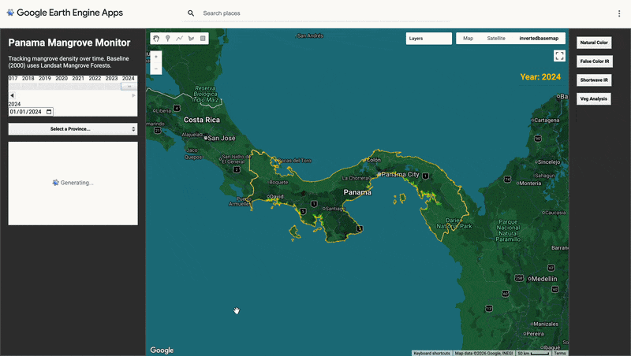

# Panama Mangrove Monitor 

## Overview
This project provides an automated, interactive dashboard for monitoring mangrove forest health along the coastlines of Panama. By leveraging a decade of satellite time-series data, this tool identifies inter-annual variability in forest density and provides a "data-first" approach to coastal conservation.

## Demo / Example
* **Live App:** [View Panama Mangrove Explorer](https://ee-markolann.projects.earthengine.app/view/panama-mangrove-monitor) 
* **Interactive Features:**
    * **Time Machine Slider:** Observe yearly forest change from 2013 to 2026.
    * **Analysis Lenses:** Toggle between Natural Color, False Color IR, and SWIR to identify forest degradation.
    * **Province Navigation:** Select specific administrative regions (e.g., Darién, Chiriquí) for localized analysis.

---

## Data Sources
* **Landsat 8 Surface Reflectance (C02/T1_L2):** High-resolution multispectral data used for time-series analysis.
* **Global Mangrove Forests (Giri et al. 2000):** Baseline dataset used as a biological mask to isolate mangrove ecosystems.
* **Provider:** U.S. Geological Survey (USGS) and NASA via Google Earth Engine.
* **Spatial Resolution:** 30m, optimized for regional-scale environmental monitoring.

---

## Data Processing and Methodology

### 1. Biological Masking
To ensure technical rigor, the analysis uses a "Mask-First" approach. All Landsat imagery is clipped and masked using the **Giri et al.** year 2000 distribution map. This ensures the dashboard highlights the health of *established* mangrove zones rather than terrestrial rainforest.

### 2. Spectral Indices
The primary metric for health is the **Normalized Difference Vegetation Index (NDVI)**:
$$NDVI = \frac{(NIR - Red)}{(NIR + Red)}$$
* **NIR:** Band 5 (Landsat 8)
* **Red:** Band 4 (Landsat 8)

### 3. Methodology Steps
1.  **Annual Compositing:** Employs a `.median()` reducer to create cloud-free annual snapshots.
2.  **Temporal Filtering:** Dynamically filters the collection based on the user-selected year from the UI slider.
3.  **UI Development:** Custom-built "Liquid Glass" interface using the `ui.Panel` and `ui.Chart` libraries.

---

## Setup & Usage

### Prerequisites
* A [Google Earth Engine](https://earthengine.google.com/) account.

### Execution
1. Open the **GEE Code Editor**.
2. Paste the `script.js` code from this repository.
3. Click **Run** to load the dashboard.
4. Use the **Date Slider** and **Analysis Buttons** to explore temporal changes.

---

## Outputs
* **Dynamic Mangrove Health Map:** A real-time rendered layer showing forest vigor.
* **NDVI Trend Charts:** Detailed temporal graphs representing "Greenness" cycles and anomalies.
* **Active Province Highlighting:** Dynamic UI feedback for regional reporting.

---

## Contact
**Mark Lannaman** [LinkedIn](https://www.linkedin.com/in/mark-lannaman-177551184/)  

